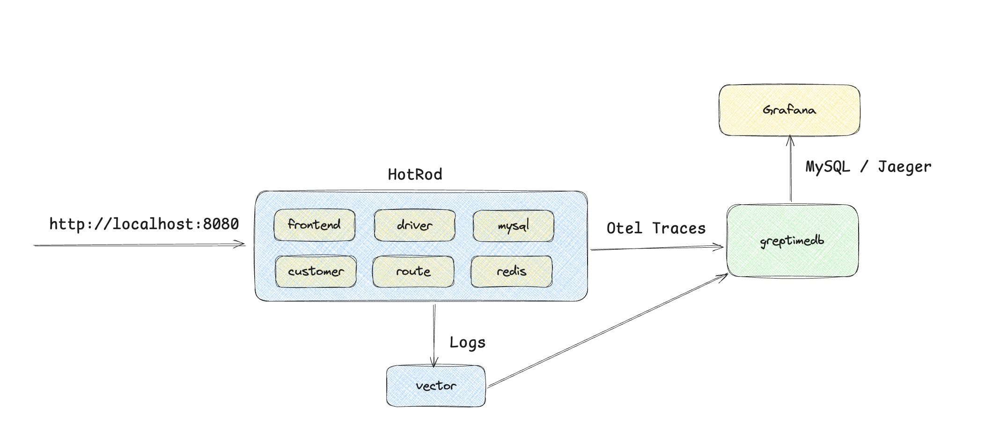
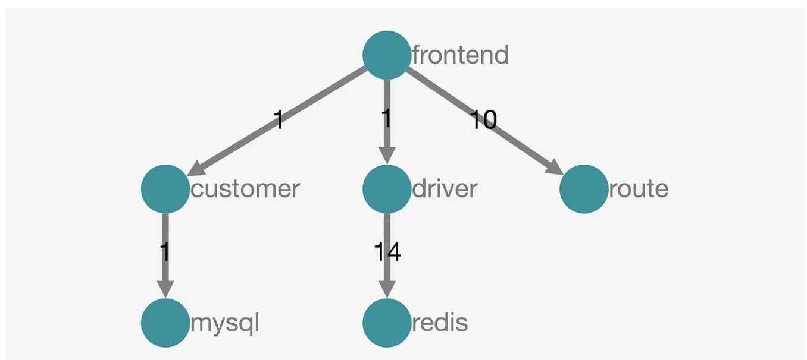

## Overview

The topology of this demo is as follows:



The `hotrod` service is a simple HTTP service that simulates a customer service:



## How to Run

```console
./run.sh
```

- Grafana: `http://localhost:3000`
- Hotrod: `http://localhost:8080`
